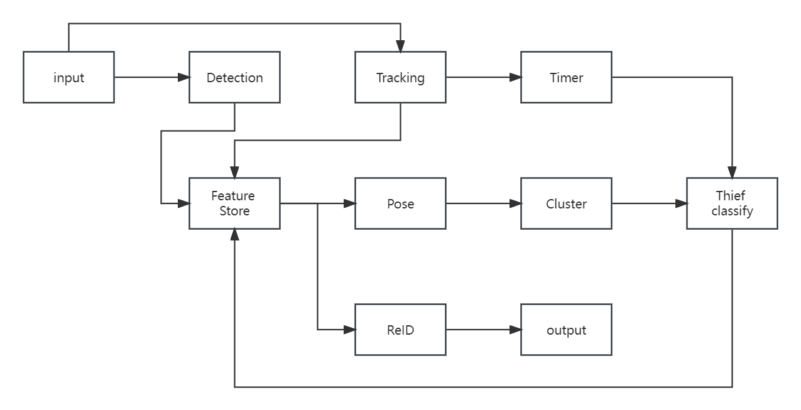

# Interface design for each module
All the module input output are JSON

## Detection
### Input
| name   | type | comment      |
|-------|:----:|----------:|
| image   | cv.mat   | image data |
| iouthresh   | float   | threshold of IOU |
| nmsthresh   | float   | threshold of NMS |
### output
| name   | type | comment      |
|-------|:----:|----------:|
| TLx   | float   | x of top left point of bounding box |
| TLy   | float   | y of top left point of bounding box |
| BRx   | float   | x of bottom right point of bounding box |
| BRy   | float   | y of bottom right point of bounding box |
| score   | float   | confidence score of bounding box |
## Tracking
### Input
| name   | type | comment      |
|-------|:----:|----------:|
| image   | cv.mat   | image data |
| frameID   | int   | index of the frame in the video |
| confthresh   | float   | threshold of confidence |
### output
| name   | type | comment      |
|-------|:----:|----------:|
| TLx   | float   | x of top left point of bounding box |
| TLy   | float   | y of top left point of bounding box |
| BRx   | float   | x of bottom right point of bounding box |
| BRy   | float   | y of bottom right point of bounding box |
| score   | float   | confidence score of bounding box |
| id   | int   | index for specific pedestrian |
## Timer
### Input
| name   | type | comment      |
|-------|:----:|----------:|
| frameID   | int   | index of the frame in the video |
| id   | int   | output of tracking module |
### output
| name   | type | comment      |
|-------|:----:|----------:|
| id   | int   | output of tracking module |
| time   | List of int   | max frame number of specific pedestrian |
## Pose
### Input
| name   | type | comment      |
|-------|:----:|----------:|
| image   | cv.mat   | image data |
| thresh   | float   | threshold of confidence |
### output
| name   | type | comment      |
|-------|:----:|----------:|
| keyPoint   | List   | list of key points |
## Cluster
### Input
| name   | type | comment      |
|-------|:----:|----------:|
| keyPoint   | List   | output of pose module |
### output
| name   | type | comment      |
|-------|:----:|----------:|
| behavior   | List of binary  | result of each keypoint. 0 as normal, 1 as abnormal |
## Thief classify
### Input
| name   | type | comment      |
|-------|:----:|----------:|
| time   | List of int   | output of Timer |
| behavior   | List of binary  | output of cluster |
### output
| name   | type | comment      |
|-------|:----:|----------:|
| thief   | List of binary  | result of each ID. 0 as normal, 1 as thief |
## ReID
### Input
| name   | type | comment      |
|-------|:----:|----------:|
| thief   | cv.mat   | output of detection when thief detected |
### output
| name   | type | comment      |
|-------|:----:|----------:|
| camID   | List of int  | thief detected in specific cam |
| timeID   | time  | time of specific frame |
| id   | int  | index for specific pedestrian |
