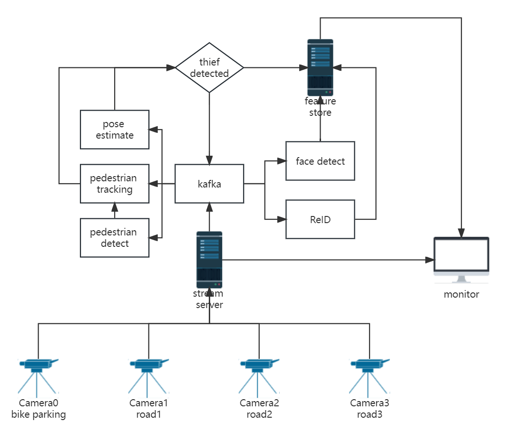

# System design

# Component
- webcam
- stream server
    - process multi-cam
    - Transform video to frames
- kafka
    - frame information
    - model output
- AI server
    - pedestrian detect
        - for tracking
        - for ReID
    - pedestrian tracking
        - dwell time
    - pose estimate
        - pose
    - thief detect
        - pose
        - dwell time
    - face detect
        - functioned when thief detected
        - get thief face
    - ReID
        - functioned when thief detected
        - track thief in multi-cam
- feature store
    - only store thief information
    - pedestrian detection result
    - face detection result
    - pose result
    - ReID result
- monitor
    - realtime monitoring
    - show model result
    - show analysis result